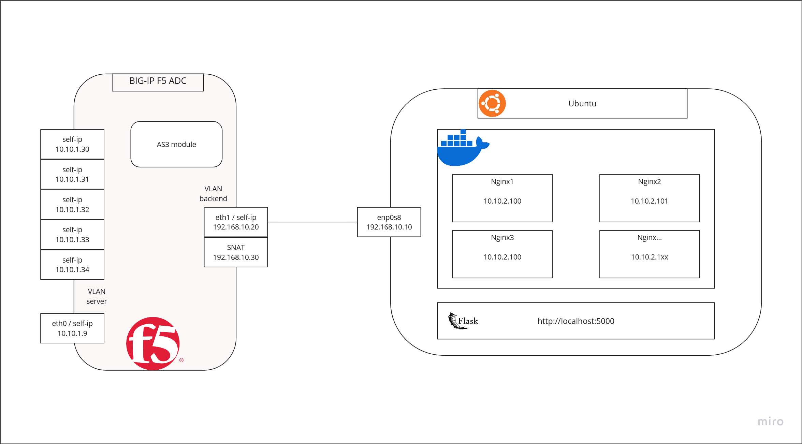
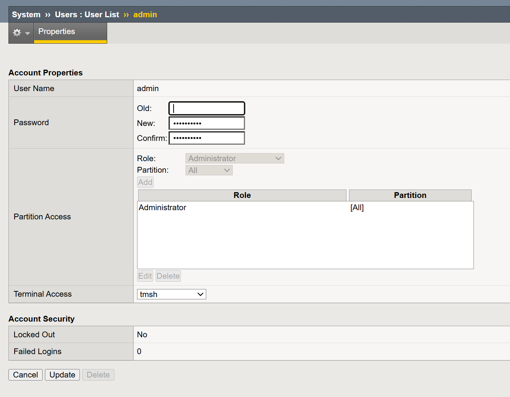
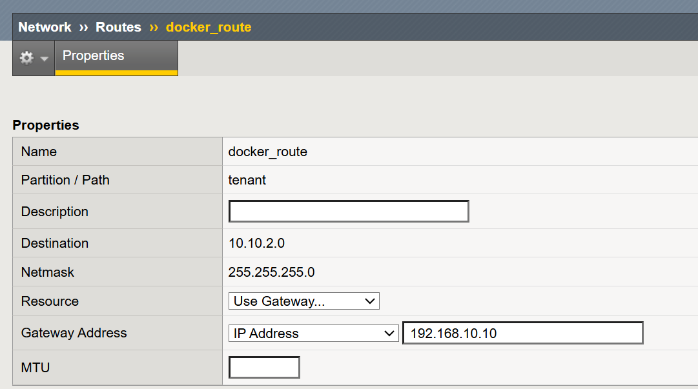
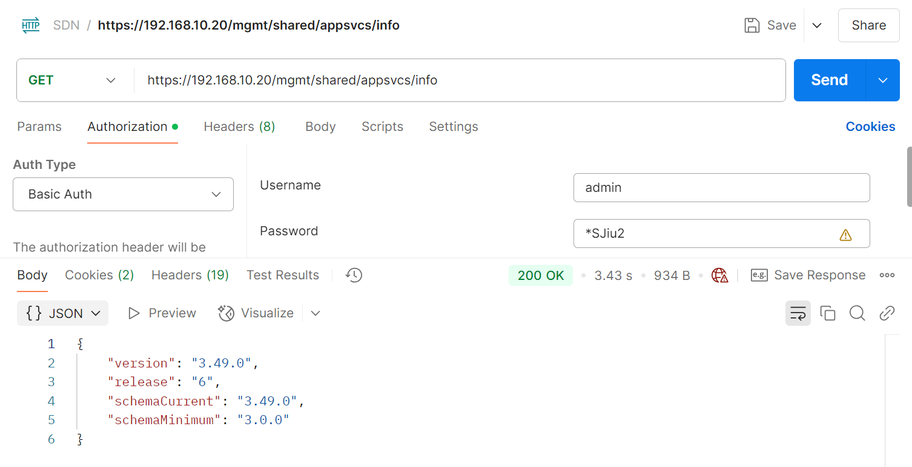

# Template et configuration d'ADC F5 avec l'API AS3

**Auteur:** Auberson Kevin  
**Basé sur la configuration de l'appliance F5 de Benjamin Valzino**  
Références: [https://git.iict-heig-vd.in/sdnnfv23/sdn-k8s-f5cis3/](https://git.iict-heig-vd.in/sdnnfv23/sdn-k8s-f5cis3/)

---

## **1. Introduction**

Ce projet a pour objectif de configurer un reverse-proxy HTTPS sur un équipement **F5 BIG-IP ADC** en utilisant l'**API AS3 (Application Services 3 Extension)**. L'objectif est de permettre l'automatisation de la configuration du F5 via des déclarations JSON, tout en assurant une gestion sécurisée des connexions grâce à un certificat SSL.

### **Objectifs du projet**

- Déploiement et configuration d'un **serveur virtuel** avec une adresse IP virtuelle (VIP).
- Création et gestion d'un **pool de serveurs backend**.
- Configuration d'un **SNAT (Source Network Address Translation)** pour gérer le trafic sortant.
- Mise en place d'un **certificat SSL** pour sécuriser les échanges HTTPS.
- Surveillance de l'état des services backend via des **moniteurs de santé**.
- Implémentation d'un **template commun** pour standardiser la configuration.

---

## **2. Technologies utilisées**

Le projet repose sur les technologies et outils suivants :

- **F5 BIG-IP ADC:** Équipement de load balancing et reverse-proxy.
- **API AS3:** Permet de configurer F5 de manière déclarative via JSON.
- **Python & Flask:** Pour l'automatisation et l'interface utilisateur.
- **Docker:** Simule des serveurs backend pour les tests.
- **Vagrant & VirtualBox:** Virtualisation de l'environnement de test.
- **OpenSSL:** Pour la génération de certificats SSL.

---

## **3. Schéma de l'architecture**

L'architecture de l'infrastructure est présentée dans le schéma ci-dessous:



---

## **4. Déploiement de l'infrastructure**

### **4.1 Prérequis**

Avant de lancer l'infrastructure, les outils suivants doivent être installés :

- **[Vagrant](https://developer.hashicorp.com/vagrant/install?product_intent=vagrant)**
- **[VirtualBox](https://www.virtualbox.org/wiki/Downloads)** (versions compatibles : 4.0.x - 7.1.x)
- Une **clé de licence valide** pour F5 BIG-IP.

#### Obtention de la clé de licence :

1. Créer un compte sur [my.f5.com](https://my.f5.com/manage/s/)
2. Aller dans `TRIALS` > `BIG-IP VE & BIG-IQ VE Free Trial`
3. Copier une clé de licence d'essai (valable 30 jours, renouvelable).

Remplacer la clé dans le fichier **Vagrantfile** :
`ENV['BIGIP_LICENSE'] ||= '<votre-clé-ici>'`

### **4.2 Lancement du projet**
Exécuter la commande suivante pour démarrer l'environnement depuis le dossier vagrant :
```bash
vagrant up
```

> **Problème rencontré :** `Timed out while waiting for the machine boot.`  
> ![[figures/vagrant-boot_timeout.png]]
> 
> **Solution:** Fermer la fenêtre de la VM et relancer en arrière-plan jusqu'à l'apparition du login.
> ![[figures/vagrant-solution-timeout.png]]

---

## **5. Configuration et mise à jour de F5**

### **5.1 Accès au système F5**

- **GUI:** [https://127.0.0.1:8443/xui/](https://127.0.0.1:8443/xui/)
- **Identifiants par défaut:**
    - admin / admin
    - root / default (à modifier lors de la première connexion)

Activer l'accès SSH en configurant `System -> Users -> User List` sous **Terminal Access = tmsh**.



### **5.2 Mise à jour vers une version compatible AS3**

1. Utiliser l'ISO de mise à jour `BIGIP-14.1.5.6-0.0.6.iso` disponible dans le dossier `references`.
2. Suivre la documentation F5 pour l'installation de l'image et le redémarrage. https://my.f5.com/manage/s/article/K51113020
	1. Perform a software update or upgrade on a BIG-IP system
	2. Reboot to the newly updated or upgraded software volume

### **5.3 Ajout de la route pour le réseau Docker**

Pour que l'appliance F5 puisse atteindre les serveurs backend hébergés sur Docker, il est nécessaire d'ajouter une route vers le réseau Docker :
```bash
tmsh create net route docker_network_route { 
	gw 192.168.10.10     
	network 10.10.2.0/24 
}
```

Cette commande définit la passerelle pour le sous-réseau des conteneurs Docker via l'IP du serveur Ubuntu.



### **5.4 Configuration du SNAT Pool**

Un **SNAT pool** est nécessaire pour assurer la translation d'adresse source afin que les paquets retournent vers l'équipement F5.

Création d'un SNAT pool via la ligne de commande :
```bash
tmsh create ltm snatpool Backend-SNAT { members add { 192.168.10.30 } }
```

Configuration dans l'interface graphique :
![[SNAT-Pool-list.png]](figures/SNAT-Pool-list.png)

---

## **6. Installation de l'API AS3**

Lien pour la prodécure: [Installation AS3](https://clouddocs.f5.com/products/extensions/f5-appsvcs-extension/latest/userguide/installation.html#downloading-the-rpm-file)

1. Charger le package `f5-appsvcs-3.49.0-6.noarch.rpm` via l'interface F5 sous `iApps > Package Management LX`.
2. Vérification de l'installation :
	`curl -k https://192.168.10.20/mgmt/shared/appsvcs/info`
    ou avec Postman
    
![[service-discovery.png]]
Le plugin f5-service-discovery s'installe automatiquement. Documentation: [https://clouddocs.f5.com/products/extensions/f5-appsvcs-extension/latest/declarations/discovery.html](https://clouddocs.f5.com/products/extensions/f5-appsvcs-extension/latest/declarations/discovery.html)

Service discovery permet au système BIG-IP de mettre à jour automatiquement les membres d'un pool d'équilibrage de charge en fonction des hôtes d'applications.

**Problème rencontré:** Erreur `iApp LX unresponsive` lors de l'installation.
![[error-iApp-LX-unsresponsive.png]]
**Solution:** Appliquer la correction via [Bug ID 776393](https://cdn.f5.com/product/bugtracker/ID776393.html).

---

## **7. Configuration et déclaration AS3**

### **7.1 Déclaration JSON AS3**

```json
{ 
	"class": "AS3", 
	"declaration": { 
		"class": "ADC", 
		"schemaVersion": "3.49.0", 
		"id": "example-declaration", 
		"tenant": { 
			"class": "Tenant", 
			"application": { 
				"class": "Application", 
				"template": "generic", 
				"service": { 
					"class": "Service_HTTPS", 
					"virtualAddresses": [vip], 
					"virtualPort": 443, 
					"pool": "web_pool", 
					"snat": "auto", 
					"serverTLS": "web_tls" 
				}, 
				"web_pool": { 
					"class": "Pool", 
					"members": [{"servicePort": 80, "serverAddresses": members}], 
					"monitors": ["http"] 
				}, 
				"web_tls": { 
					"class": "TLS_Server", 
					"certificates": [{ "certificate": "web_cert" }] 
				}, "web_cert": { 
					"class": "Certificate", 
					"certificate": cert, 
					"privateKey": key 
				} 
			} 
		} 
	} 
}
```
Ici vip, members, cert et key sont des variables python.

Voici une explication de l'utilisation de chacun des champs :

Entête de la déclaration AS3
- `"class": "AS3"` : Spécifie qu'il s'agit d'une déclaration AS3.
- `"declaration"` : Contient la configuration spécifique aux services F5.

Classe ADC (Application Delivery Controller)
- `"class": "ADC"` : Définit que cette déclaration est destinée à configurer un contrôleur de livraison d'application.
- `"schemaVersion": "3.49.0"` : Version du schéma AS3 utilisé.
- `"id": "example-declaration"` : Un identifiant unique pour cette déclaration, utile pour la gestion et la mise à jour.

Configuration du tenant
- `"class": "Tenant"` : Un tenant est une unité logique d'organisation de services. Cela permet d'isoler les configurations par application. 
- Le tenant encapsule les applications et leurs services.

Définition de l'application
- `"class": "Application"` : Spécifie qu'il s'agit d'une configuration d'application. 
- Contient la configuration du service et des composants associés.

Configuration du Virtual Server (Service HTTPS)
- `"template": "generic"` : Utilisation d'un modèle générique pour l'application.
- `"class": "Service_HTTPS"` : Définit un serveur virtuel HTTPS.
- `"virtualAddresses": [vip]` : L'adresse IP publique (VIP) sur laquelle le service sera accessible.
- `"virtualPort": 443` : Le port d'écoute de la connexion HTTPS.
- `"pool": "web_pool"` : Associe le service au pool de serveurs backend.
- `"snat": "auto"` : Active la translation d'adresse source automatique pour éviter les problèmes de routage retour.
- `"serverTLS": "web_tls"` : Associe le service HTTPS à un certificat TLS pour sécuriser les connexions.

Configuration du pool backend
- `"class": "Pool"` : Définit un pool de serveurs backend.
- `"members"` : Liste des adresses IP des serveurs backend et leur port (port 80 pour HTTP).
- `"monitors": ["http"]` : Configure un monitor HTTP pour vérifier la disponibilité des serveurs.

Configuration TLS (Certificat SSL)
- `"class": "TLS_Server"` : Définit la configuration TLS pour sécuriser les connexions.
- `"certificates"` : Référence au certificat défini plus bas dans la déclaration.

Définition du certificat SSL
- `"class": "Certificate"` : Définit un certificat SSL.
- `"certificate"` : Contient le certificat public en base64.
- `"privateKey"` : Clé privée associée au certificat.

---

## **8. Test de création du reverse-proxy**

### **8.1 Génération du certificat SSL**

Pour assurer la sécurité des communications HTTPS, j'ai généré un certificat auto-signé à l'aide d'OpenSSL.  
Les commandes suivantes ont été utilisées :
```bash
# Générer une clé privée 
openssl genrsa -out my_key.key 2048   
# Générer une requête de signature de certificat (CSR) 
openssl req -new -key my_key.key -out my_csr.csr -subj "/C=CH/ST=Vaud/L=Yverdon/O=HEIG/OU=IT/CN=10.10.1.30"  
# Générer un certificat auto-signé valide pour 365 jours 
openssl x509 -req -days 365 -in my_csr.csr -signkey my_key.key -out my_cert.crt
```

> **Remarque:**  
> Le **Common Name (CN)** doit correspondre à l'adresse IP de votre Virtual Server, qui est l'une des **self-IP** disponibles sur F5.

### **8.2 Déploiement de la configuration via Flask**

Une fois le certificat et la clé générés, j'ai utilisé mon application Flask pour envoyer la déclaration AS3 à l'API de l'appliance F5.

Le formulaire permet de renseigner les informations suivantes :

- **Virtual IP (VIP):** Adresse IP virtuelle du Virtual Server.
- **Backend Members:** Liste des serveurs backend (séparés par des virgules).
- **Certificat:** Contenu du certificat SSL.
- **Clé privée:** Contenu de la clé privée.

![[config-reverse-proxy.png]](figures/config-reverse-proxy.png)

Après soumission du formulaire, une réponse avec le code HTTP `200 OK` confirme le succès de la configuration.

![[200-ok.png]](figures/200-ok.png)

### **8.3 Vérification de la déclaration AS3 appliquée**

Pour vérifier si la déclaration a été correctement appliquée, nous avons effectué une requête `GET` à l'API F5 sur l'endpoint suivant :
![[as3-task.png]](figures/as3-task.png)
### **8.5 Modification de la configuration SNAT via GUI**

Par défaut, l'option `Source Address Translation` est configurée en mode `auto`. Pour garantir un routage correct vers les serveurs backend, nous avons modifié ce paramètre pour utiliser le SNAT Pool configuré précédemment.

Les étapes suivantes ont été effectuées :

1. Accéder au Virtual Server dans la GUI.
2. Modifier le paramètre `Source Address Translation` en sélectionnant l'option **SNAT**.
3. Sélectionner le SNAT Pool préconfiguré `Backend-SNAT`.
 
![[vip.png]](figures/vip.png)

### **8.6 Test de l'accès au site web via HTTPS**

Enfin, j'ai testé l'accès au site web en utilisant la commande cURL :

`curl -k https://10.10.1.31`

![[success.png]](figures/success.png)

---

## **9. Conclusion**

Ce projet a permis de démontrer la capacité de l'**appliance F5 BIG-IP ADC** à fonctionner en tant que **reverse-proxy sécurisé** pour des applications web hébergées dans des conteneurs Docker. L'utilisation de l'**API AS3** a facilité l'automatisation des configurations réseau et applicatives, rendant le déploiement rapide et fiable.

Les principaux objectifs ont été atteints :
- **Automatisation complète de la configuration** via une interface web intuitive développée en Flask.
- **Déploiement efficace du reverse-proxy HTTPS**, avec gestion des certificats SSL et des adresses IP virtuelles (VIP).
- **Intégration réussie avec un pool backend** de serveurs Nginx tournant sous Docker.
- **Monitoring fonctionnel** via l’intégration de probes HTTP sur les membres du pool pour assurer la haute disponibilité.

Au cours du projet, plusieurs défis techniques ont été rencontrés :
- La méconnaissance des concepts et commandes spécifiques à **Vagrant**  et à **F5 BIG-IP** a entraîné une prise en main plus longue que prévue.
- L’appliance F5 ne pouvait pas atteindre les serveurs backend situés dans un sous-réseau Docker distinct. **Solution** : Ajout d'une route statique sur F5 vers le réseau Docker en spécifiant la passerelle Ubuntu


Pour améliorer davantage l'infrastructure et l'automatisation du projet, plusieurs pistes d'amélioration sont à envisager :
- La configuration automatique du SNAT pool lors dans la VIP lors de la prise en compte de la déclaration AS3.
- Mettre des floating IPs à la place des selfs IPs pour le déploiement des VIPs pour permettre le basculement transparent en cas de panne d'un serveur backend.
- Utilisation d'outils comme **Ansible** pour automatiser la mise en place de l'environnement (installation de F5, configuration AS3, génération des certificats)    
- Intégration d’une solution de gestion automatisée des certificats via **Let's Encrypt** pour éviter l'utilisation de certificats auto-signés.
- Ajouter des outils tels que **Prometheus** et **Grafana** pour une surveillance plus détaillée des performances et de l'état des services backend.


## **10. Sources / références**

[F5 BIG-IP AS3](https://clouddocs.f5.com/products/extensions/f5-appsvcs-extension/latest/refguide/apidocs.html)
[BIG-IP AS3 API Reference](https://clouddocs.f5.com/products/extensions/f5-appsvcs-extension/latest/refguide/as3-api.html?highlight=task)
[Composing a BIG-IP AS3 Declaration](https://clouddocs.f5.com/products/extensions/f5-appsvcs-extension/latest/userguide/composing-a-declaration.html)
[Application Services 3 Extension Documentation](https://clouddocs.f5.com/products/extensions/f5-appsvcs-extension/3.13/)
[https://git.iict.ch/sdnnfv19/sdn-f5-rest](https://git.iict.ch/sdnnfv19/sdn-f5-rest)
[https://git.iict.ch/sdnnfv23/sdn-k8s-f5cis3](https://git.iict.ch/sdnnfv23/sdn-k8s-f5cis3)

